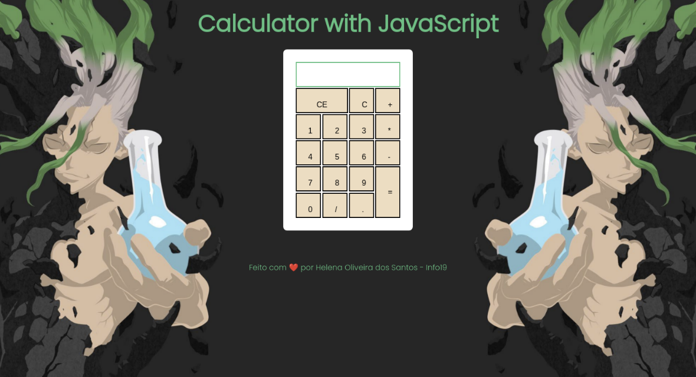

# Calculadora Basica com JavaScript

Calculadora que realiza cálculos básicos usando JavaScript puro.   O objetivo é se familiarizar com a linguagem JS.

<a href="https://helenaoliveira366.github.io/Calculadora-Basica-com-JavaScript/" target="_blank">Clique aqui para visualizá-la no Github Pages</a>

> Não possui versão para dispositivos Mobile 

### Tecnologias Usadas:
<ul>
  <li>HTML</li>
  <li>CSS</li>
  <li>JavaScript</li>
</ul>
